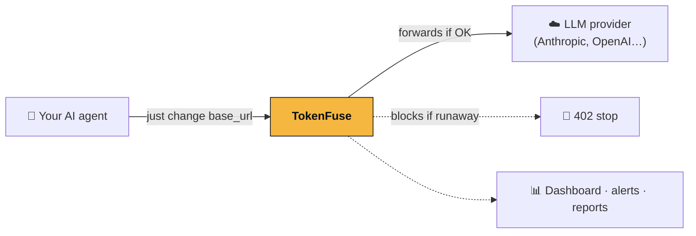
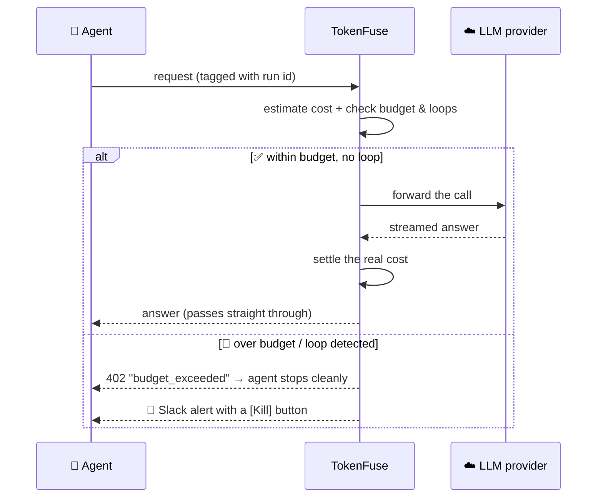
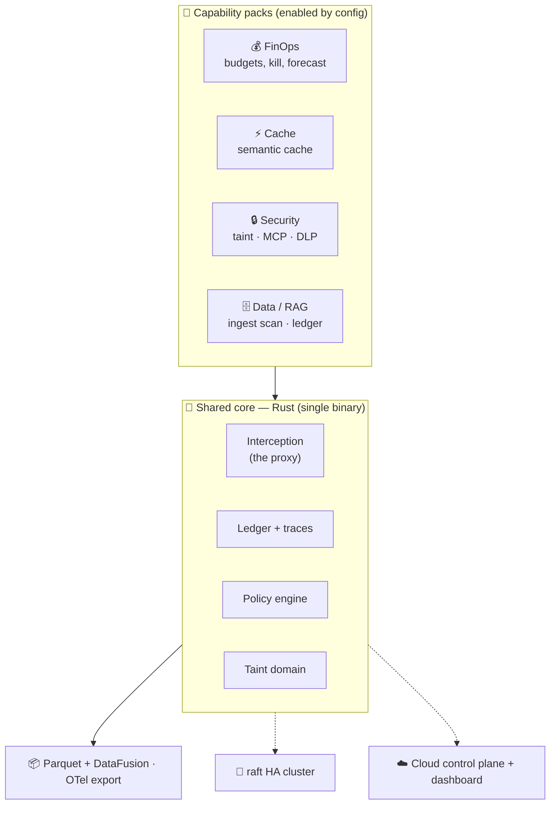
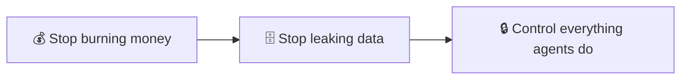

<div align="center">


# TokenFuse

### The runtime firewall for AI agents — enforce budgets, stop runaways, keep secrets out of the model.

**Observability shows you the fire. TokenFuse is the automatic fire extinguisher.**


</div>

---

TokenFuse is a **drop-in proxy** between your AI agents and their LLM providers. It watches every call, adds up the real cost as it happens, and — the instant an agent goes rogue (burns through its budget, spins in a loop, or tries to leak a secret) — it **cuts the circuit in real time**, before the damage lands. You point your agent at it with a one-line base-URL change; no SDK, no rewrite.

> **⚡ Try it in one command** — no signup, no config:
> ```bash
> docker run -p 4100:4100 ghcr.io/taipanbox/tokenfuse
> ```
> Full walkthrough: [**🚀 Get started**](#-get-started).

<div align="center">


<sub>The hosted Cloud dashboard — fleet <b>burn rate</b>, per-run spend vs. cap, near-cap alerts, and a per-run kill-switch. One visual identity — <i>the fuse</i> — shared with the <a href="#-tokenfuse-for-iphone--apple-watch">iOS app</a>. <code>cd cloud && docker compose up</code>.</sub>

</div>

---

## 📑 Table of contents

- [The problem TokenFuse solves](#-the-problem-tokenfuse-solves)
- [**🚀 Get started**](#-get-started) ← install & first run
- [How it works](#-how-it-works)
- [How TokenFuse compares](#-how-tokenfuse-compares) ← vs. observability, gateways, guardrails
- [What's inside](#-whats-inside)
- [TokenFuse for iOS](#-tokenfuse-for-iphone--apple-watch) ← the fleet on your phone
- [Architecture](#-architecture)
- [Project status](#-project-status)
- [The bigger picture](#-the-bigger-picture-a-runtime-firewall)
- [Who is this for?](#-who-is-this-for)
- [Glossary](#-glossary-for-newcomers) · [FAQ](#-faq) · [Docs](#-documentation)

---

## 🔥 The problem TokenFuse solves

A chatbot makes **one** call to an LLM. An **agent** makes *hundreds* — it thinks, calls a tool, reads the result, thinks again, retries, and loops. That loop is what makes agents powerful, and it's also what makes them dangerous in three specific ways:

### 1. Cost runs away silently

Agents burn tokens **10–100× faster** than a chatbot, and a single bad loop compounds fast — one documented code-review agent ballooned from **2,000 to 120,000 tokens** on a *single task* after a self-improvement loop. The failure mode that hurts most is that **nothing looks wrong**: a looping agent still returns `200 OK`, so your APM stays green while the meter spins. The bill is the first and only symptom — and by then the money is spent.

### 2. "Per-key" limits don't understand agents

The unit that matters for an agent is the **run** — one whole task, start to finish, spanning many calls and often several sub-agents. Traditional controls cap a *user* or an *API key*. Neither can say "this one task has a $2 ceiling," neither notices that call #34 is identical to call #31 (a loop), and neither can stop a task mid-flight.

### 3. Agents are a new, live attack surface

Autonomous agents read untrusted web pages, call external **MCP** tools, and hold credentials. **65%** of organizations reported an AI-agent security incident in the last year, and **82%** discovered a *shadow* agent they didn't know was running. Prompt injection, secret exfiltration, and tool "rug-pulls" are runtime problems — they can't be fixed by a code review before deploy.

**TokenFuse addresses all three, in the request path, in real time** — enforcing per-run budgets, detecting loops, and acting as a security boundary for what agents can spend and leak.

<div align="center">



*A drop-in proxy. No SDK required, no rewrite of your agent.*

</div>

---

## 🚀 Get started

TokenFuse is a **proxy**: start it, then point your agent at it instead of the provider. Three steps, ~2 minutes.

### Step 1 — Start TokenFuse

Published to GitHub Container Registry, so it runs anywhere with Docker — nothing to compile:

```bash
docker run -p 4100:4100 ghcr.io/taipanbox/tokenfuse
```

A working gateway on **http://localhost:4100**, using a built-in fake provider so you can try it offline.

<details><summary>Prefer to build from source? (needs Rust)</summary>

```bash
git clone https://github.com/TAIPANBOX/tokenfuse.git
cd tokenfuse
cargo run -p tokenfuse-gateway      # gateway on http://localhost:4100
```
</details>

### Step 2 — Point it at your real LLM provider

Tell TokenFuse where the provider is with `TOKENFUSE_UPSTREAM`, then send your agent's traffic to `localhost:4100`. Your provider API key is passed straight through — TokenFuse never needs it.

```bash
docker run -p 4100:4100 \
  -e TOKENFUSE_UPSTREAM=https://api.anthropic.com/v1/messages \
  ghcr.io/taipanbox/tokenfuse
```

Then change **one line** in your app — the base URL:

```bash
export ANTHROPIC_BASE_URL=http://localhost:4100   # Anthropic SDK
export OPENAI_BASE_URL=http://localhost:4100       # OpenAI-style SDKs
```

Your agent runs exactly as before — TokenFuse just watches every call.

### Step 3 — Give a run a budget

Add two headers: a **run id** (a name for the whole task) and a **budget**. TokenFuse tallies the real cost live and returns **HTTP 402** the moment the task would blow past its cap.

```bash
curl http://localhost:4100/v1/messages \
  -H "content-type: application/json" \
  -H "x-fuse-run-id: my-agent-task-1" \
  -H "x-fuse-budget-usd: 0.50" \
  -d '{"model":"claude-sonnet","max_tokens":100,"messages":[{"role":"user","content":"hi"}]}'
```

- **No `x-fuse-run-id`?** The call is passed through untouched — safe to drop in.
- **Live view:** `docker exec <container> tokenfuse top` shows every run and its $/min.

**Observe first, then enforce.** By default TokenFuse runs in **shadow** mode — it records what it *would* block but changes nothing, so you can drop it in risk-free. Flip to **enforce** when you trust it:

```bash
docker run -p 4100:4100 -e TOKENFUSE_MODE=enforce \
  -e TOKENFUSE_UPSTREAM=https://api.anthropic.com/v1/messages \
  ghcr.io/taipanbox/tokenfuse
```

`TOKENFUSE_MODE` = `shadow` (default) · `warn` · `enforce`.

---

## ⚙️ How it works

Every request flows through TokenFuse. It estimates the cost *before* the call, reserves it against the run's budget, forwards it only if it's safe, then reconciles the real cost from the streamed response.



Three properties make this safe in production:

1. **Shadow → Warn → Enforce.** Start in shadow mode (observe only); flip to enforce when you trust it.
2. **Fail-open by default.** If TokenFuse itself has trouble, your traffic keeps flowing — it never becomes a single point of failure. (And for the reverse — never *losing* a budget — it can run as a raft-replicated [HA cluster](docs/10-ha-cluster.md).)
3. **Metadata-only.** It measures cost and behavior; it does **not** store prompt contents by default.

**Latency:** the enforcement decision adds **~0.4 µs p99** in-process; on the wire the gateway adds **~1 ms p50 / ~2 ms p99** over a direct provider call — negligible next to an LLM response measured in hundreds of ms to seconds. Method + numbers: [BENCHMARKS.md](BENCHMARKS.md).

---

## 🎯 How TokenFuse compares

There are excellent tools *around* this problem. None of them sit in the request path and **act on a per-run basis** the way TokenFuse does. The categories:

| Category | Examples | What they do | The gap |
|---|---|---|---|
| **Observability / tracing** | Langfuse, Helicone, LangSmith | Record calls, dashboards, evals, cost reports | A rearview mirror — they tell you what you *already spent* |
| **AI gateways / proxies** | LiteLLM, Portkey, Cloudflare AI Gateway | Routing, caching, fallbacks, **per-key / per-user** rate + spend limits | Key-scoped, not **run**-scoped; no loop detection; can't stop a task mid-flight |
| **FinOps / cost tools** | Vantage, CloudZero | Attribute cloud spend after the fact | Not in the request path; can't prevent anything |
| **Agent guardrails** | Guardrails AI, Lakera, NeMo | Content safety, prompt-injection filtering | Focused on *content*, usually SDK-level; no cost / loop / runtime enforcement |

### Capability matrix

| Capability |  TokenFuse | 🪞 Observability | 🚦 Gateways | 🛡️ Guardrails |
|---|:---:|:---:|:---:|:---:|
| Show how much you spent | ✅ | ✅ | ✅ | — |
| Per-key / per-user spend limits | ✅ | ❌ | ✅ | ❌ |
| **Per-run budgets** (a whole agent task) | ✅ | ❌ | ⚠️ partial | ❌ |
| **Loop / runaway detection** | ✅ | ❌ | ❌ | ❌ |
| **Enforce — stop before the damage** | ✅ | ❌ | ⚠️ key caps only | ⚠️ content only |
| Live kill-switch (from Slack / dashboard) | ✅ | ❌ | ❌ | ❌ |
| **Budgets survive a crash** (HA, no double-spend) | ✅ | ❌ | ❌ | ❌ |
| Secrets kept out of the model (MCP broker) | ✅ | ❌ | ❌ | ⚠️ partial |
| Shadow-agent discovery (eBPF) | ✅ | ❌ | ❌ | ❌ |

### What has no equivalent we're aware of

TokenFuse's core bet is **enforcement, not observation** — and a few of its capabilities have, to our knowledge, no direct equivalent in another tool:

- **Loop-aware enforcement at the proxy.** Gateways cap a key; none *detect a runaway loop* and cut it off mid-task.
- **Per-run budgets linearized across an HA cluster.** Reserve/settle runs through a raft state machine, so several gateways serving the same run can't *both* slip past one ceiling — a distributed no-double-spend guarantee for budgets.
- **MCP credential brokering.** The agent holds only a *handle* (`{{secret:token}}`); the real secret is injected at the boundary, so it never enters the prompt, trace, or the model's memory.
- **eBPF shadow-agent discovery.** Find agents by the LLM traffic they emit, with zero application changes.

TokenFuse is **complementary** to observability and gateways — many teams will run it *alongside* Langfuse or LiteLLM. It's the enforcement layer they don't have.

---

## 🧩 What's inside

Everything below is **implemented and shipped in v0.3.0** (see [PROGRESS.md](PROGRESS.md) for the per-component status and tests).

<div align="center">


<sub><code>tokenfuse top</code> — a live <code>htop</code>-style view of every run's spend against its budget; press <kbd>k</kbd> to kill a runaway.</sub>

</div>

**Cost & control**
- 💰 **Per-run budgets** — a hard cap for a whole task, with hierarchical roll-up so a sub-agent's spend counts against its parent.
- 🔁 **Loop / runaway detection** — identical-call, ping-pong, and context-growth detectors.
- 🛑 **Kill-switch** — hard-stop a run from the API, the `tokenfuse top` TUI, Slack, or the Cloud dashboard.
- 🧩 **Policies as code (WASM)** — custom rules in any language, sandboxed; **backtest** them over past traffic.
- ⚡ **Semantic cache** — repeated questions served for **$0**.

**Security (agent runtime firewall)**
- 🔒 **Agent firewall (taint)** — block risky actions after an agent touches untrusted data.
- 🕵️ **DLP** — detect/redact secrets leaving in prompts.
- 🔑 **MCP credential-broker** + tool-poisoning / rug-pull scanner.
- 📡 **eBPF Radar** — discover shadow agents on a host, zero config (Linux).

**Ops & platform**
- 🧬 **HA raft cluster** — replicated budgets, durable storage, runtime membership, token auth + TLS.
- ☁️ **Hosted Cloud** — Rust control plane + Next.js dashboard: fleet-wide spend, kill-switch, and central budgets across many gateways.
- 📱 **[TokenFuse for iOS](#-tokenfuse-for-iphone--apple-watch)** — pair a phone, watch burn rate live, and pull an Enclave-signed kill from the Dynamic Island.
- 🗄️ **Zero-DB analytics** — telemetry in open **Parquet**, queried with `tokenfuse sql "..."`; OTel export.
- 🐍 **Python SDK**, sub-µs decision path, four public container images.

---

## 📱 TokenFuse for iPhone & Apple Watch


A native **iPhone & Apple Watch** command deck for your fleet: pair a device once, watch every agent's **burn rate** live, get alerted the moment one runs hot, and pull a **hardware-backed kill switch** — *signed on-device by the Secure Enclave*, so a stolen token alone can't stop your agents. Face-ID budgets, live burn charts, and the burn rate in the **Dynamic Island** — with the same on your **Apple Watch**, including a two-tap wrist kill and a face complication. It shares one visual language — *the fuse* — with the [web dashboard](cloud/dashboard).

The app has its own repository, with screenshots, a full feature tour, and build instructions:

### → **[github.com/TAIPANBOX/tokenfuse-mobile](https://github.com/TAIPANBOX/tokenfuse-mobile)**

Its plan & wire protocol and the shared design system still live here: [docs/14](docs/14-mobile-companion.md) · [docs/16](docs/16-design-system.md).

---

## 🏗️ Architecture

One fast **Rust** binary in the request path, a **Rust** control plane for the Cloud, a **Next.js** dashboard. Telemetry lives in open **Parquet** files instead of a heavy database.



Design decisions and the data model: [docs/02-architecture.md](docs/02-architecture.md).

---

## 📋 Project status

**v0.3.0 — functional and shipped, young and not yet battle-tested.**

The full request path (budget enforcement, SSE passthrough, loop detection, hierarchical budgets), the intelligence/ops layer (semantic cache, WASM policies, backtesting, Parquet + `tokenfuse sql`, OTel, `tokenfuse top`, Python SDK), the security packs (agent firewall/taint, DLP, MCP scanner + credential-broker), eBPF Radar, the raft **HA cluster** (durable storage, membership, auth, TLS), and the **hosted Cloud** (control plane + dashboard, telemetry, fleet-wide kill-switch, central budgets) are all implemented, tested in CI, and published as container images.

Since v0.3.0, **[TokenFuse for iOS](#-tokenfuse-for-iphone--apple-watch)** (pairing, live fleet, Enclave-signed kill, burn charts, Dynamic Island) has been built end-to-end, and the web dashboard has been restyled to share the app's "fuse" identity — one look across the browser and the phone.

It has **not** yet had a production hardening pass or a security audit — treat it as an early, capable release you can evaluate today, not a turnkey enterprise product. Run it in **shadow mode** first.

```bash
docker run -p 4100:4100 ghcr.io/taipanbox/tokenfuse          # gateway
cd cloud && docker compose up                                 # + Cloud dashboard (:3000)
```

Images on GHCR: `tokenfuse` · `tokenfuse:cluster` · `tokenfuse-control-plane` · `tokenfuse-dashboard`.

---

## 🧭 The bigger picture: a runtime firewall

TokenFuse starts as a cost tool and grows into an **agent runtime firewall** — one brand, one install. The parts reinforce each other (that's the moat): a single taint domain follows data from the web → RAG → memory → tool calls, so the thing that catches a prompt injection is the same thing that enforces a budget.



Rationale ("one product, not three"): [docs/09-product-strategy.md](docs/09-product-strategy.md).

---

## 👥 Who is this for?

- **AI / ML engineers** shipping agents to production who've been surprised by a bill.
- **Platform / DevOps teams** who need guardrails and cost visibility across many agents.
- **Security teams** worried about what autonomous agents can *do* — prompt injection, data exfiltration, shadow agents.
- **Solo builders** who want a safety net that installs in one command.

---

## 📖 Glossary for newcomers

| Term | Plain-English meaning |
|---|---|
| **LLM** | The AI model behind the scenes (Claude, GPT…). You pay per "token" it reads and writes. |
| **Token** | A chunk of text (~¾ of a word). Billing is per token. |
| **Agent** | An AI that works in a loop: think → act → observe → repeat. Powerful, but can spiral. |
| **Run** | One complete agent task, start to finish — possibly hundreds of LLM calls. |
| **Runaway** | An agent stuck looping or exploding in cost — the thing TokenFuse stops. |
| **Proxy** | A middleman in the request path. You point your agent at it instead of the provider. |
| **MCP** | A standard for agents to call external tools/servers — powerful, and a new security surface. |
| **Prompt injection** | A hidden instruction smuggled into data the agent reads, hijacking its behavior. |

---

## ❓ FAQ

**Will it slow my agent down?** Negligibly — ~1 ms p50 added on the wire, and responses stream straight through (no buffering). See [BENCHMARKS.md](BENCHMARKS.md).

**Do I have to change my code?** No — change one base-URL env var so calls go through TokenFuse. An optional Python SDK adds nicer error handling.

**Does it read or store my prompts?** No — metadata-only by default. It measures cost and behavior, not content.

**What if TokenFuse goes down?** It's **fail-open**: traffic keeps flowing. For the opposite guarantee (never losing a budget), run the raft **HA cluster**.

**Is it free?** The core is **open source (Apache-2.0)**. A hosted Cloud and advanced packs are the intended paid tiers.

**Is it production-ready?** It's a young v0.3.0 — functional and CI-tested, but not yet audited or battle-hardened. Start in shadow mode and evaluate.

---

## 📚 Documentation

| Document | What's inside |
|---|---|
| [PROGRESS.md](PROGRESS.md) | Live component-by-component build status & tests |
| [BENCHMARKS.md](BENCHMARKS.md) | Latency methodology + numbers |
| [01 · Research](docs/01-research.md) | The pain points and hard numbers behind the idea |
| [02 · Architecture](docs/02-architecture.md) | Rust core, ADRs, data model, policy language |
| [03 · Roadmap](docs/03-roadmap.md) | Phases, demo script, metrics, risks |
| [06 · Semantic cache](docs/06-semantic-cache.md) · [07 · Taint model](docs/07-taint-model.md) | Detailed subsystem designs |
| [08 · Security extensions](docs/08-security-extensions.md) | MCP broker, RAG scanning, agent identity |
| [10 · HA cluster](docs/10-ha-cluster.md) · [11 · Hosted Cloud](docs/11-hosted-cloud.md) · [12 · MCP credential-broker](docs/12-mcp-credential-broker.md) | The distributed + cloud + security layers |
| [13 · Security model & hardening](docs/13-security-hardening.md) | Trust boundaries, implemented controls, `cargo audit` gate |
| [14 · Mobile companion](docs/14-mobile-companion.md) · [16 · Design system](docs/16-design-system.md) | The iOS app (TokenFuse) plan + wire protocol, and the shared "fuse" visual identity |

---

## 📜 License

[Apache License 2.0](LICENSE).

<div align="center">
<sub>Built in the open. Diagrams render natively on GitHub (Mermaid).</sub>
</div>
