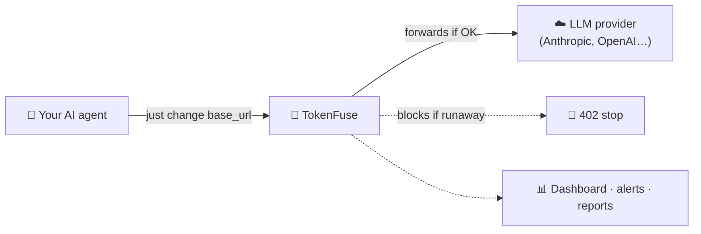
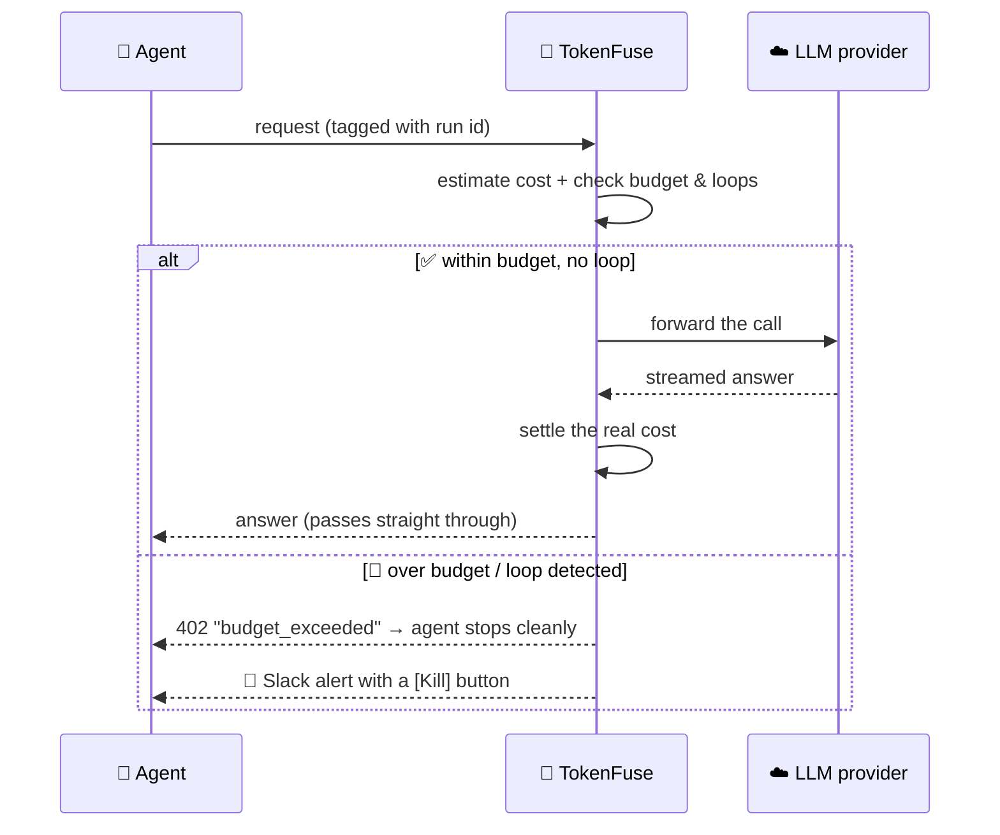
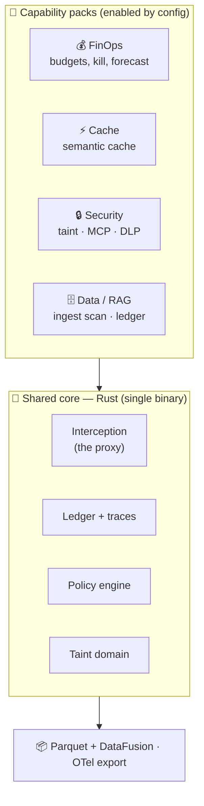
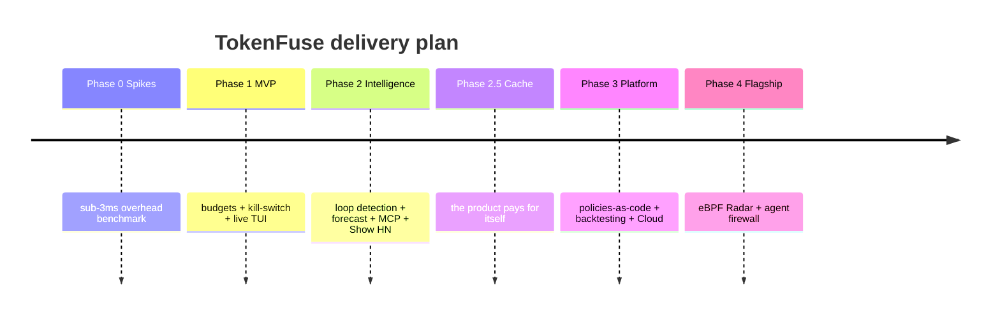
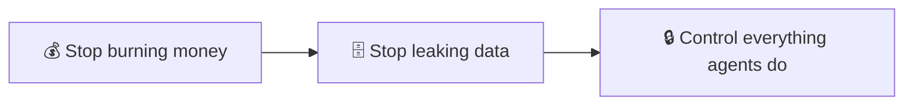

<div align="center">

# 🧯 TokenFuse

### Runtime control for AI agents — budgets, runaway detection, and a kill-switch.

**Observability shows you the fire. TokenFuse is the automatic fire extinguisher.**


</div>

---

## 🧠 In plain words (30-second version)

Modern AI **agents** don't make one call to an AI model — they make *hundreds* in a loop, thinking, retrying, calling tools. When an agent gets stuck in a loop, it keeps calling the model… and every call costs money. People have woken up to **thousand-dollar bills from a single bug**.

The scary part: your normal monitoring **can't see it**. A looping agent still looks "healthy" — it returns `200 OK`. The bill is the only symptom, and by then it's too late.

> **TokenFuse sits between your agent and the AI provider like a fuse in an electrical circuit.** It watches every call, adds up the real cost live, and the moment an agent goes rogue — burns through its budget or spins in a loop — it *cuts the circuit* before the damage is done. Then it pings you on Slack with a **[Kill]** button.

<div align="center">



*A drop-in proxy. No SDK required, no rewrite of your agent.*

</div>

---

> **⚡ Try it in one command** — no signup, no config:
> ```bash
> docker run -p 4100:4100 ghcr.io/taipanbox/tokenfuse
> ```
> Full walkthrough below: [**🚀 Get started**](#-get-started).

---

## 📑 Table of contents

- [**🚀 Get started**](#-get-started) ← install & first run
- [The problem](#-the-problem-in-numbers)
- [How it works](#-how-it-works)
- [What makes it different](#-what-makes-it-different)
- [Feature overview](#-feature-overview)
- [Architecture](#-architecture)
- [Roadmap](#-roadmap)
- [The bigger picture: capability packs](#-the-bigger-picture-capability-packs)
- [90 seconds to "wow"](#-90-seconds-to-wow)
- [Who is this for?](#-who-is-this-for)
- [Glossary for newcomers](#-glossary-for-newcomers)
- [FAQ](#-faq)
- [Project status & docs](#-project-status--documentation)

---

## 🔥 The problem, in numbers

These figures come from mid-2026 industry reports (DORA, Stack Overflow, GitGuardian, CSA, OWASP). Full sources in [docs/01-research.md](docs/01-research.md).

| What's happening | The number |
|---|---|
| How much faster agents burn tokens vs. a chatbot | **10–100×** |
| A real code-review agent that ballooned after a self-improvement loop | **2,000 → 120,000** tokens on one task |
| Organizations that hit an AI-agent security incident in the past year | **65%** |
| Organizations that discovered a *shadow* (unknown) AI agent | **82%** |
| Teams running RAG (AI + your own data) in production | **72%** |

**Why existing tools don't solve it:**

- 🪞 **Observability tools** (Langfuse, Helicone) are a *rearview mirror* — they tell you what you already spent.
- 🚦 **Gateways** (LiteLLM, Portkey) can cap a key or a user, but have **no idea what a "run" is** and can't detect a loop.
- 🔕 **Your APM** (Datadog etc.) sees `200 OK` and stays silent while the agent spins.

TokenFuse is the missing piece: it **stops the bleeding in real time**, not after the invoice.

---

## ⚙️ How it works

Every request flows through TokenFuse. It estimates the cost *before* the call, reserves it against a budget, and only forwards the call if it's safe. After the response, it reconciles the real cost.



Three ideas make this safe to put in production:

1. **Shadow → Warn → Enforce.** Start in *shadow* mode: TokenFuse watches and reports what it *would* have blocked, changing nothing. Flip to *enforce* only when you trust it.
2. **Fail-open by default.** If TokenFuse itself has a problem, your traffic keeps flowing — it never becomes a single point of failure.
3. **Metadata-only.** It measures cost and behavior; it does **not** store your prompt contents by default.

### How fast is "in the path"?

The enforcement decision (estimate → policy → reserve → settle) adds **~0.4 µs at p99**; a full request handled in-process is **~4.7 µs at p99** — three orders of magnitude under the 3 ms budget. Method and full table: [BENCHMARKS.md](BENCHMARKS.md). Reproduce with `cargo run -p tokenfuse-gateway --release --example bench`, or the on-the-wire benchmark with [`bench/run.sh`](bench/run.sh).

---

## 🚀 Get started

TokenFuse is a **proxy**: you start it, then point your agent at it instead of the provider. Three steps, ~2 minutes. No SDK, no code changes.

### Step 1 — Start TokenFuse

The image is published to GitHub Container Registry, so it runs anywhere with Docker — nothing to compile:

```bash
docker run -p 4100:4100 ghcr.io/taipanbox/tokenfuse
```

That's a working gateway on **http://localhost:4100** using a built-in fake provider, so you can try it offline.

<details><summary>Prefer to build from source? (needs Rust)</summary>

```bash
git clone https://github.com/TAIPANBOX/tokenfuse.git
cd tokenfuse
cargo run -p tokenfuse-gateway      # gateway on http://localhost:4100
```
</details>

### Step 2 — Point it at your real LLM provider

Tell TokenFuse where the real provider is with `TOKENFUSE_UPSTREAM`, then send your agent's traffic to `localhost:4100`. Your provider API key is passed straight through — TokenFuse never needs it.

```bash
docker run -p 4100:4100 \
  -e TOKENFUSE_UPSTREAM=https://api.anthropic.com/v1/messages \
  ghcr.io/taipanbox/tokenfuse
```

Then in your app, change **one line** — the base URL:

```bash
# Anthropic SDK
export ANTHROPIC_BASE_URL=http://localhost:4100
# OpenAI-style SDKs
export OPENAI_BASE_URL=http://localhost:4100
```

Your agent runs exactly as before — TokenFuse just watches every call.

### Step 3 — Give a run a budget

Add two headers to your requests: a **run id** (a name for the whole agent task) and a **budget**. TokenFuse adds up the real cost live and returns **HTTP 402** the moment the task would blow past its cap.

```bash
curl http://localhost:4100/v1/messages \
  -H "content-type: application/json" \
  -H "x-fuse-run-id: my-agent-task-1" \
  -H "x-fuse-budget-usd: 0.50" \
  -d '{"model":"claude-sonnet","max_tokens":100,"messages":[{"role":"user","content":"hi"}]}'
```

- **No `x-fuse-run-id`?** The call is passed through untouched — safe to drop in.
- **Want the live view?** `docker exec <container> tokenfuse top` (or `cargo run -p tokenfuse-gateway top`) shows every run and its $/min.

**Observe first, then enforce.** By default TokenFuse runs in **shadow** mode — it *records* what it would block but changes nothing, so you can drop it in risk-free. When you're ready to actually cut the circuit (return `402` on a breach), start it in **enforce** mode:

```bash
docker run -p 4100:4100 -e TOKENFUSE_MODE=enforce \
  -e TOKENFUSE_UPSTREAM=https://api.anthropic.com/v1/messages \
  ghcr.io/taipanbox/tokenfuse
```

`TOKENFUSE_MODE` = `shadow` (default) · `warn` · `enforce`.

> Everything the project needs lives on GitHub — source, CI, and the container image (GHCR). **No dedicated server required.**

---

## 🎯 What makes it different

| Capability | 🧯 TokenFuse | 🪞 Observability<br/>(Langfuse, Helicone) | 🚦 Gateways<br/>(LiteLLM, Portkey) |
|---|:---:|:---:|:---:|
| Show how much you spent | ✅ | ✅ | ✅ |
| Per-key / per-user limits | ✅ | ❌ | ✅ |
| **Per-run budgets** (a whole agent task) | ✅ | ❌ | ⚠️ partial |
| **Loop / runaway detection** | ✅ | ❌ | ❌ |
| **Auto-stop before the damage** (enforcement) | ✅ | ❌ | ❌ |
| **Burn forecast** ("blowout in ~12 steps") | ✅ | ❌ | ❌ |
| Live kill-switch (Slack button) | ✅ | ❌ | ❌ |

The one-line summary: **everyone else reports; TokenFuse acts.**

---

## ✨ Feature overview

| Feature | What it gives you | Ships in |
|---|---|---|
| 💰 Per-run budgets | Hard cost cap for a whole agent task, not just a key | Phase 1 |
| 🛑 Kill-switch in Slack | One-click stop on a runaway alert | Phase 1 |
| 📟 `tokenfuse top` | A live `htop`-style terminal view of every running agent and its $/min | Phase 1 |
| 🔁 Loop detection | Catches "same tool called 3× in a row" and ping-pong loops | Phase 2 |
| 📈 Burn forecast | Predicts a budget blowout *before* it happens | Phase 2 |
| 🤝 Self-aware agents (MCP) | The agent can *see* its own budget and *ask a human* for more | Phase 2 |
| 🗄️ Zero-DB analytics | Your data in open Parquet files; query with `tokenfuse sql "..."` | Phase 2 |
| ⚡ Semantic cache | Repeated questions answered for **$0** — the product pays for itself | Phase 2.5 |
| 🧩 Policies as code (WASM) | Write custom rules in any language; test them on past traffic | Phase 3 |
| 📡 Radar (eBPF) | Finds *shadow* agents on your machines with **zero config** | Phase 4 |
| 🔒 Agent firewall (taint) | Blocks risky actions after an agent touches untrusted data | Phase 4 |
| 🧬 HA cluster (raft) | Budgets survive a node crash; the affordability check is **linearized** across nodes so no two agents double-spend the same ceiling | Phase 4 |

---

## 🏗️ Architecture

One binary. A fast **Rust** core in the request path, a **Go** control plane for the cloud, a **Next.js** dashboard. Telemetry lives in open **Parquet** files instead of a heavy database.



Design decisions and the full data model live in [docs/02-architecture.md](docs/02-architecture.md).

---

## 🗺️ Roadmap

Built as a **series of public launches**, not one big release — each phase is its own "wow" moment.



**To public launch (Show HN): ~12–13 weeks** of solo full-time work. Details, estimates, and risks in [docs/03-roadmap.md](docs/03-roadmap.md).

---

## 🧭 The bigger picture: capability packs

TokenFuse starts as a cost tool and grows into an **agent runtime firewall** — all under one brand, one install. The parts reinforce each other (that's the moat), so they ship as *packs* you switch on, not separate products.



The reasoning behind "one product, not three" is in [docs/09-product-strategy.md](docs/09-product-strategy.md); the expansion plan is in [docs/04-expansion-rings.md](docs/04-expansion-rings.md).

---

## 🎬 90 seconds to "wow"

The intended first-run experience (and, not coincidentally, the script for the launch demo video):

```text
00:00  docker run tokenfuse                 ← one line, zero config
00:10  export ANTHROPIC_BASE_URL=http://localhost:4100
       your agent runs exactly as before
00:20  tokenfuse top                        ← live runs, $/min sparklines
00:35  launch a "broken" agent (deliberate loop)
00:45  the run turns red: "loop detected · blowout at step ~34"
00:55  Slack alert with a [Kill run] button
01:00  the agent receives a clean stop signal and shuts down
01:10  tokenfuse sql "select task_type, sum(cost) group by 1"
01:25  "Rust · one binary · your data in Parquet."
```

---

## 👥 Who is this for?

- **AI / ML engineers** shipping agents to production who've been surprised by a bill.
- **Platform / DevOps teams** who need guardrails and cost visibility across many agents.
- **Security teams** worried about what autonomous agents can *do* (prompt injection, data exfiltration).
- **Solo builders** who want a safety net that installs in one command.

---

## 📖 Glossary for newcomers

| Term | Plain-English meaning |
|---|---|
| **LLM** | The AI model behind the scenes (e.g. Claude, GPT). You pay per word ("token") it reads and writes. |
| **Token** | A chunk of text (~¾ of a word). Billing is per token — more tokens, more cost. |
| **Agent** | An AI that works in a loop: think → act → observe → repeat. Powerful, but can spiral. |
| **Run** | One complete agent task from start to finish — possibly hundreds of LLM calls. |
| **Runaway** | An agent stuck looping or exploding in cost — the thing TokenFuse stops. |
| **Proxy** | A middleman that sits in the request path. You point your agent at it instead of the provider. |
| **RAG** | "Retrieval-Augmented Generation" — feeding the AI your own documents so it can answer about them. |
| **MCP** | A standard way for agents to call external tools/servers. Powerful and a new security surface. |
| **Prompt injection** | A hidden instruction smuggled into data the agent reads, hijacking its behavior. |

---

## ❓ FAQ

**Will it slow my agent down?**
The target is **under 3 ms** of added latency (p99). Responses stream straight through — TokenFuse doesn't buffer them.

**Do I have to change my code?**
No. You change one environment variable (`base_url`) so calls go through TokenFuse. An optional SDK adds nicer error handling.

**Does it read or store my prompts?**
No — metadata-only by default. It measures cost and behavior, not content. Prompt inspection is a separate, explicit opt-in.

**What if TokenFuse itself goes down?**
It's **fail-open**: your traffic keeps flowing. It's a safety net, never a chokepoint.

**Is it free?**
The core is **open source (Apache-2.0)**. A hosted Cloud version and advanced packs will be the paid tiers.

**Is it ready to use?**
Not yet — this repository is currently the **design and planning phase**. Follow along; code is coming.

---

## 📋 Project status & documentation

> **Status:** early implementation. The Rust core (money, pricing, reserve/settle ledger, policy), the budget-enforcing gateway (real SSE passthrough, loop detection, 402 contract), an observability API + `tokenfuse top` TUI, and a Python SDK are built and CI-green — see [PROGRESS.md](PROGRESS.md) and [BENCHMARKS.md](BENCHMARKS.md). Not yet production-ready. The design docs below remain the source of truth for direction.

| Document | What's inside |
|---|---|
| [01 · Research](docs/01-research.md) | The pain points and hard numbers behind the idea |
| [02 · Architecture](docs/02-architecture.md) | Rust core, decisions (ADRs), data model, policy language |
| [03 · Roadmap](docs/03-roadmap.md) | Phases 0–5, the demo script, metrics, risks |
| [04 · Expansion rings](docs/04-expansion-rings.md) | How the platform grows: cache → RAG → security → governance |
| [05 · Open questions](docs/05-open-questions.md) | Decisions still to be made before coding |
| [06 · Semantic cache](docs/06-semantic-cache.md) | Detailed design: partitions, thresholds, invalidation |
| [07 · Taint model](docs/07-taint-model.md) | The "agent firewall": labels, propagation, policies |
| [08 · Security extensions](docs/08-security-extensions.md) | MCP credential broker, RAG ingestion scanning, agent identity |
| [09 · Product strategy](docs/09-product-strategy.md) | Why one product with capability packs, not three tools |

---

## 📜 License

[Apache License 2.0](LICENSE).

<div align="center">
<sub>Built in the open. Diagrams above render natively on GitHub (Mermaid).</sub>
</div>
