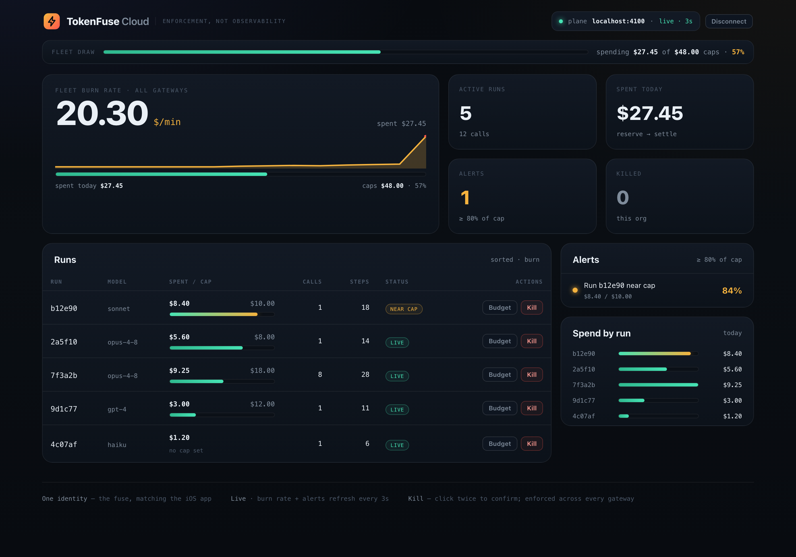
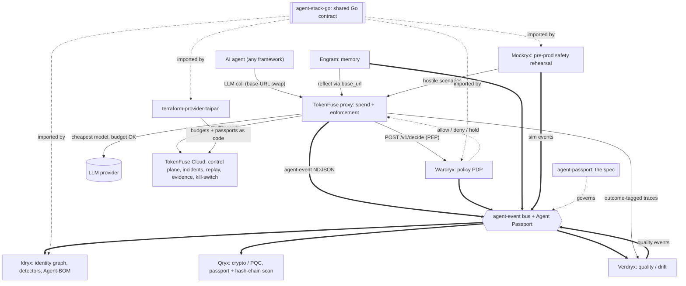
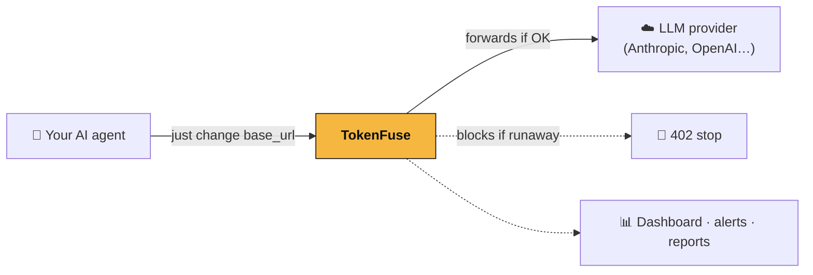
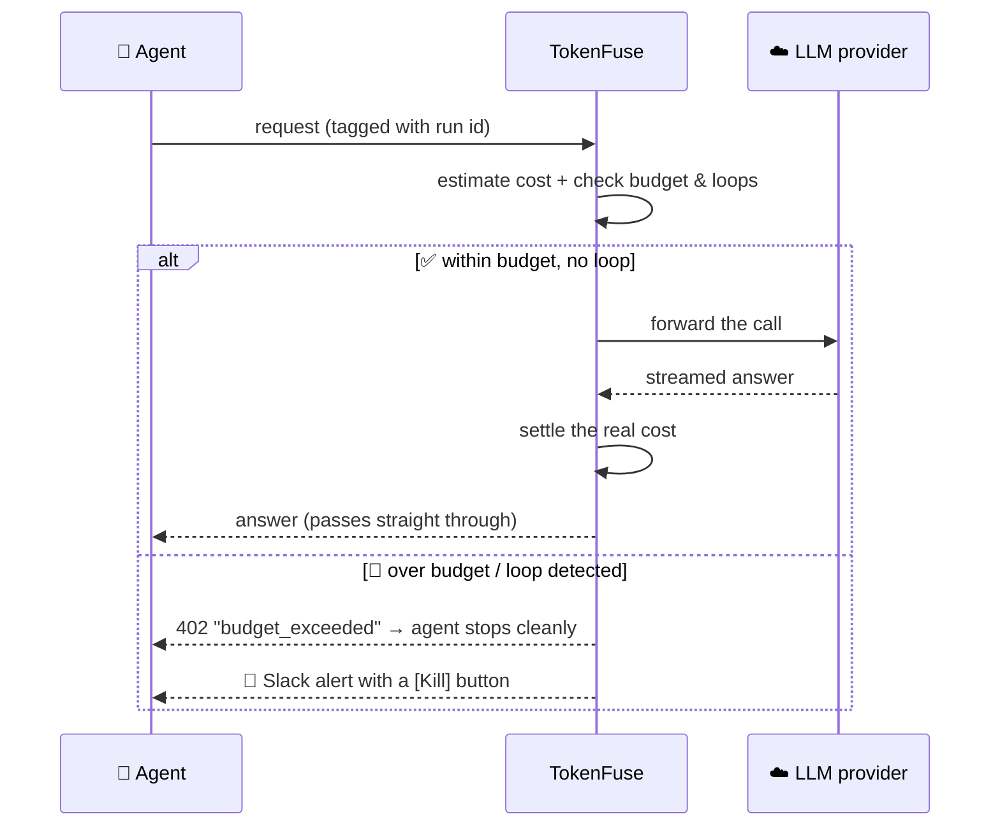
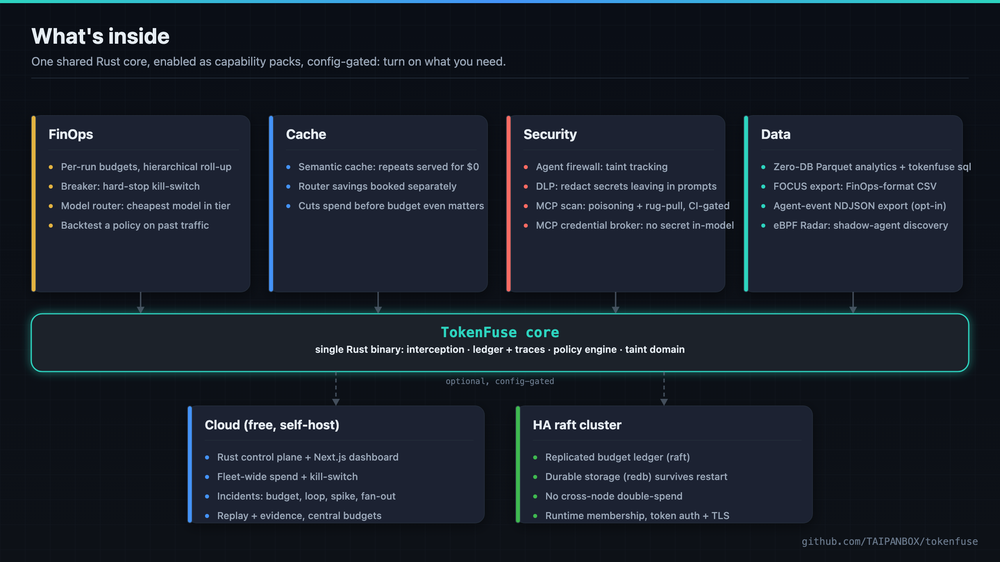
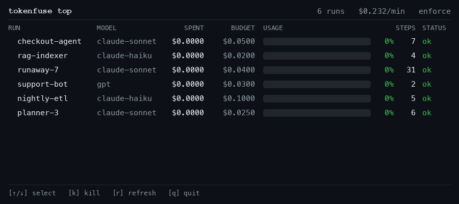
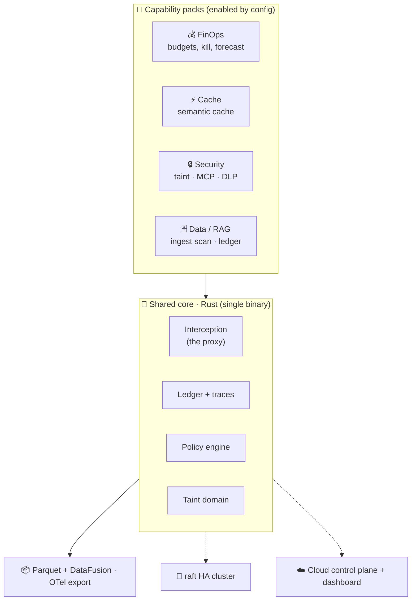
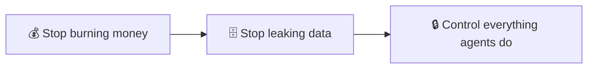

<div align="center">


# TokenFuse

### The runtime kill-switch for AI agents: cap their spend, stop runaway loops before they bill you.

**A proxy you drop in front of every LLM call — it also blocks poisoned MCP tools and keeps secrets out of the model.**

> The kill-switch isn't just an API call — it's signed on-device by your iPhone's Secure Enclave, so a stolen API token alone can't stop (or fake-stop) your agents.


</div>

---

TokenFuse is a **drop-in proxy** between your AI agents and their LLM providers. It watches every call, adds up the real cost as it happens, and, the instant an agent goes rogue (burns through its budget, spins in a loop, or tries to leak a secret), it **cuts the circuit in real time**, before the damage lands. You point your agent at it with a one-line base-URL change; no SDK, no rewrite. It also ships a free scanner that catches a poisoned or "rug-pulled" MCP tool before your agent ever calls it, and a broker that keeps the secrets that tool needs out of the model's context entirely.

> **⚡ Try it in one command**, no signup, no config:
> ```bash
> docker run -p 4100:4100 ghcr.io/taipanbox/tokenfuse
> ```
> Full walkthrough: [**🚀 Get started**](#-get-started).

<div align="center">



<sub>The Cloud dashboard: fleet <b>burn rate</b>, per-run spend vs. cap, near-cap alerts, and a per-run kill-switch. Its tagline is literal: <b>enforcement, not observability</b>. One visual identity, <i>the fuse</i>, shared with the <a href="#-tokenfuse-for-iphone--apple-watch">iPhone &amp; Apple Watch app</a>. <code>cd cloud && docker compose up</code>.</sub>

<sub><a href="https://taipanbox.github.io/tokenfuse/preview/"><b>▶ Live preview</b></a>: the dashboard with sample data, in your browser, no backend and no install.</sub>

</div>

---

## Where this fits in the stack

TokenFuse is the **spend plane and the hot-path spine** of the TAIPANBOX agent-governance stack: every agent LLM call passes through it, where it meters cost, routes to the cheapest model that meets the task tier, asks Wardryx for a per-request policy decision, and enforces the budget Breaker. The other services read the events it emits.



- **Consumes**: agent LLM calls (one base-URL swap); Wardryx decisions (TokenFuse is the enforcement point, the PEP).
- **Produces**: priced and enforced upstream calls, agent-event NDJSON, CallRecords to its Cloud control plane, and outcome-tagged Parquet traces.
- **Talks to**: **Wardryx** (per-request policy), its own **Cloud** control plane, and every downstream consumer (**Idryx**, **Qryx**, **Verdryx**) via the event bus. Configured by **terraform-provider-taipan**; rehearsed against by **Mockryx**.

The full stack is TokenFuse (spend), Wardryx (policy), Engram (memory), Idryx (access), Qryx (crypto), Verdryx (quality), Mockryx (pre-prod), on the shared Agent Passport + agent-event contract (agent-stack-go / agent-passport), configured via terraform-provider-taipan.

Run the whole open stack locally with one command via [**stack-up**](https://github.com/TAIPANBOX/stack-up); the stack's home on the web is [**it-rat.com**](https://it-rat.com).

## Live infrastructure validation

Before any public launch, TokenFuse was run on real Linux infrastructure with a real Anthropic key: a
4-node raft cluster across two datacenters (no double-spend, no split-brain), real enforcement under a
34-agent concurrent burst, and a matched-protocol cost-accounting run on Hetzner, AWS, and GCP.


Full write-up, all numbers, and the real bugs live testing found (and fixed): [`VALIDATION.md`](VALIDATION.md).

---


## 📑 Table of contents

- [The problem TokenFuse solves](#-the-problem-tokenfuse-solves)
- [**Why TokenFuse is different**](#-why-tokenfuse-is-different) ← the differentiators
- [How it works](#-how-it-works)
- [How TokenFuse compares](#-how-tokenfuse-compares) ← vs. observability, gateways, guardrails
- [What's inside](#-whats-inside)
- [**🚀 Get started**](#-get-started) ← install & first run
- [Scan your MCP servers & gate CI](#-scan-your-mcp-servers--gate-ci) ← free scanner + GitHub Action
- [TokenFuse for iPhone & Apple Watch](#-tokenfuse-for-iphone--apple-watch) ← the fleet on your phone & wrist
- [Architecture](#-architecture)
- [Project status](#-project-status)
- [The bigger picture](#-the-bigger-picture-a-runtime-firewall)
- [Who is this for?](#-who-is-this-for)
- [Glossary](#-glossary-for-newcomers) · [FAQ](#-faq) · [Docs](#-documentation)

---

## 🔥 The problem TokenFuse solves

A chatbot makes **one** call to an LLM. An **agent** makes *hundreds*: it thinks, calls a tool, reads the result, thinks again, retries, and loops. That loop is what makes agents powerful, and it's also what makes them dangerous in three specific ways:

### 1. Cost runs away silently

Agents burn tokens dramatically faster than a single chatbot turn: one study of agentic **coding** tasks found they can consume up to **1,000× more tokens** than a single code-chat query — driven mostly by growing input context, not output — and that runs on the *same* task can vary by up to **30×** in total tokens depending on how the loop unfolds ([Bai et al., 2026](https://arxiv.org/abs/2604.22750)). The failure mode that hurts most is that **nothing looks wrong**: a looping agent still returns `200 OK`, so your APM stays green while the meter spins. The bill is the first and only symptom, and by then the money is spent.

### 2. "Per-key" limits don't understand agents

The unit that matters for an agent is the **run**: one whole task, start to finish, spanning many calls and often several sub-agents. Traditional controls cap a *user* or an *API key*. Neither can say "this one task has a $2 ceiling," neither notices that call #34 is identical to call #31 (a loop), and neither can stop a task mid-flight.

### 3. Agents are a new, live attack surface

Autonomous agents read untrusted web pages, call external **MCP** tools, and hold credentials. **65%** of organizations reported an AI-agent security incident in the last year, and **82%** discovered a *shadow* agent they didn't know was running ([Cloud Security Alliance / Token Security, "Autonomous but Not Controlled," Apr. 2026](https://cloudsecurityalliance.org/artifacts/autonomous-but-not-controlled-ai-agent-incidents-now-common-in-enterprises)). Prompt injection, secret exfiltration, and tool "rug-pulls" (a tool that changes behavior silently after a human already approved it) are runtime problems, and they can't be fixed by a code review before deploy.

**TokenFuse addresses all three, in the request path, in real time**, by enforcing per-run budgets, detecting loops, and acting as a security boundary for what agents can spend and leak.

<div align="center">



*A drop-in proxy. No SDK required, no rewrite of your agent.*

</div>

---

## 🎯 Why TokenFuse is different

Most of the tooling around AI agents watches, logs, or filters. TokenFuse sits **in the request path** and can actually stop something, in real time, at the layer where the money and the secrets move. Five things about that we haven't found built together anywhere else:

### 1. Enforcement, not observability

That's the dashboard's own tagline, and it's literal, not marketing. TokenFuse doesn't just chart what an agent spent after the fact: it estimates cost *before* the call, checks it against the run's budget and a loop detector, and returns **HTTP 402** the instant a run would go over — cutting the circuit before the provider bills you, not after. `shadow → warn → enforce` lets you prove this against real traffic before you ever let it block anything. A dashboard tells you the fire happened; TokenFuse is the breaker.

### 2. A hardware-signed, out-of-band kill switch

Every kill you can trigger from TokenFuse (the API, `tokenfuse top`, Slack, the Cloud dashboard) has a sibling on your iPhone and Apple Watch: a Face-ID-gated Breaker whose kill request is **signed on-device by the Secure Enclave** before it ever reaches your fleet. That matters specifically when the thing running away is the agent host itself: the phone in your pocket is a genuinely independent control path, not another tab on the same machine that might be the one misbehaving.

### 3. Budgets that survive a crash

A budget only means something if two gateways racing each other can't both spend it, and if it doesn't vanish the moment a process dies mid-run. TokenFuse's per-run budgets are **hierarchical** — a sub-agent's spend rolls up and is checked against every ancestor, all-or-nothing — and, in cluster mode, are replicated across nodes through a **raft** state machine that can persist durably to disk (redb). The affordability check is linearized across the whole gateway fleet, so there's no cross-node double-spend, and — with durable storage enabled — a budget outlives not just a node crash but a full process restart.

### 4. Drop-in, fail-open, and fast

Point `TOKENFUSE_UPSTREAM` at Anthropic, or at any endpoint that speaks the **Anthropic Messages API** (the gateway serves `/v1/messages`; an OpenAI-compatible `/v1/chat/completions` front is planned but not yet implemented, see [docs/02](docs/02-architecture.md)), and TokenFuse prices and enforces against all of it from the same binary, with a fallback price for models it doesn't recognize rather than silently letting spend go untracked. It's a one-line base-URL swap, **shadow mode first** so it's risk-free to drop in, **fail-open** so it's never a single point of failure, works fully offline against a built-in fake provider, and it's Rust: the enforcement decision itself adds well under a microsecond in-process (~0.4 µs p99 — see [BENCHMARKS.md](BENCHMARKS.md)).

### 5. Catch a poisoned MCP tool for free, and gate CI on it

`tokenfuse mcp-scan` is a standalone, free CLI: point it at a live MCP server over Streamable HTTP or SSE, and it checks tool descriptions for injection phrases and hidden characters, then pins a fingerprint of every tool you approve and flags a **rug pull** the moment a tool's description or schema silently changes on a later fetch — exactly the supply-chain gap MCP's re-fetch-on-connect model opens up. It ships as a GitHub Action, so a rug pull fails the PR, not a future incident review; [docs/17](docs/17-rugpull-demo.md) has a runnable, self-contained demo of the whole catch. At runtime, the companion **MCP credential-broker** goes further and keeps secrets out of the model entirely: the agent only ever holds a handle like `{{secret:github_token}}`, and the real value is injected at the last hop, never in the prompt, the trace, or the model's memory.

Also worth knowing, in more detail under [What's inside](#-whats-inside): a semantic cache that serves repeated questions for $0, budget/step policies you can **backtest** against real traffic before turning them on, eBPF-based shadow-agent discovery with zero application changes, and a hosted Cloud fleet view for when one gateway isn't enough.

**Self-funding.** The token blowouts above — a single task's usage swinging by up to 30× depending on how the loop unfolds — are exactly what a per-run budget is built to catch on call one, not on the invoice three days later. Most teams don't need an ROI deck for this: the first runaway TokenFuse blocks tends to cover the bill.

---

## ⚙️ How it works

<div align="center">


<sub>The money diagram: every call is priced and gated in-line, before it reaches the provider. Enforcement, not observability.</sub>
</div>

Every request flows through TokenFuse. It estimates the cost *before* the call, reserves it against the run's budget, forwards it only if it's safe, then reconciles the real cost from the streamed response.



Three properties make this safe in production:

1. **Shadow → Warn → Enforce.** Start in shadow mode (observe only); flip to enforce when you trust it.
2. **Fail-open by default.** If TokenFuse itself has trouble, your traffic keeps flowing, so it never becomes a single point of failure. (And for the reverse, never *losing* a budget, it can run as a raft-replicated [HA cluster](docs/10-ha-cluster.md).)
3. **Metadata-only.** It measures cost and behavior; it does **not** store prompt contents by default.

Because cost is *estimated* before the call and *settled* after it, TokenFuse's numbers are a fast pre-flight approximation reconciled against real usage, not a hard real-time guarantee — see the [FAQ](#-faq) for what that means in practice.

**Latency:** the enforcement decision adds **~0.4 µs p99** in-process; on the wire the gateway adds **~0.8 ms p50 / ~2 ms p99** over a direct provider call, negligible next to an LLM response measured in hundreds of ms to seconds. Method + numbers: [BENCHMARKS.md](BENCHMARKS.md).

---

## 🎯 How TokenFuse compares

There are excellent tools *around* this problem. None of the categories below sit in the request path and **act on a per-run basis** the way TokenFuse does.

| Category | What they do | The gap |
|---|---|---|
| **Observability / tracing** | Record calls, dashboards, evals, cost reports | A rearview mirror: they tell you what you *already* spent |
| **AI gateways / proxies** | Routing, caching, fallbacks, **per-key / per-user** rate + spend limits | Key-scoped, not **run**-scoped; no loop detection; can't stop a task mid-flight |
| **FinOps / cost tools** | Attribute cloud spend after the fact | Not in the request path; can't prevent anything |
| **Agent guardrails / content scanners** | Content safety, prompt-injection filtering | Focused on *content*, usually SDK-level; no cost / loop / runtime enforcement |

### Capability matrix

| Capability |  TokenFuse | 🪞 Observability | 🚦 Gateways | 🛡️ Guardrails |
|---|:---:|:---:|:---:|:---:|
| Show how much you spent | ✅ | ✅ | ✅ | – |
| Per-key / per-user spend limits | ✅ | ❌ | ✅ | ❌ |
| **Per-run budgets** (a whole agent task) | ✅ | ❌ | ⚠️ partial | ❌ |
| **Loop / runaway detection** | ✅ | ❌ | ❌ | ❌ |
| **Enforce: stop before the damage** | ✅ | ❌ | ⚠️ key caps only | ⚠️ content only |
| Live kill-switch (from Slack / dashboard) | ✅ | ❌ | ❌ | ❌ |
| Hardware-signed kill (Secure Enclave) | ✅ | ❌ | ❌ | ❌ |
| **Budgets survive a crash** (HA, no double-spend) | ✅ | ❌ | ❌ | ❌ |
| Free MCP poisoning / rug-pull scan, CI-gated | ✅ | ❌ | ❌ | ⚠️ partial |
| Secrets kept out of the model (MCP broker) | ✅ | ❌ | ❌ | ⚠️ partial |
| Shadow-agent discovery (eBPF) | ✅ | ❌ | ❌ | ❌ |

### What has no equivalent we're aware of

TokenFuse's core bet is **enforcement, not observation**, and a few of its capabilities have, to our knowledge, no direct equivalent in another tool:

- **Loop-aware enforcement at the proxy.** Gateways cap a key; none *detect a runaway loop* and cut it off mid-task.
- **Per-run budgets linearized across an HA cluster.** Reserve/settle runs through a raft state machine, so several gateways serving the same run can't *both* slip past one ceiling, a distributed no-double-spend guarantee for budgets.
- **A hardware-signed kill outside the agent host.** A phone or watch that signs the stop request on-device, so the control path doesn't depend on the machine that might be compromised.
- **MCP credential brokering.** The agent holds only a *handle* (`{{secret:token}}`); the real secret is injected at the boundary, so it never enters the prompt, trace, or the model's memory.
- **eBPF shadow-agent discovery.** Find agents by the LLM traffic they emit, with zero application changes.

TokenFuse is **complementary** to observability and gateways; many teams will run it *alongside* their existing tracing or routing layer. It's the enforcement layer they don't have.

---

## 🧩 What's inside

<div align="center">


<sub>One shared core, enabled as config-gated capability packs.</sub>
</div>

Everything below is **implemented on `main` and tested in CI** (see [PROGRESS.md](PROGRESS.md) for the per-component status and tests); see [Project status](#-project-status) for exactly which of it is in the tagged **v0.4.0** release versus landed on `main` since.

<div align="center">



<sub><code>tokenfuse top</code>: a live <code>htop</code>-style view of every run's spend against its budget; press <kbd>k</kbd> to kill a runaway.</sub>

</div>

**Cost & control**
- 💰 **Per-run budgets**: a hard cap for a whole task, with hierarchical roll-up so a sub-agent's spend counts against its parent.
- 🔁 **Loop / runaway detection**: identical-call, ping-pong, and context-growth detectors.
- 🛑 **Breaker**: hard-stop a run (kill-switch) from the API, the `tokenfuse top` TUI, Slack, or the Cloud dashboard.
- 🧩 **Policies as code (WASM)**: custom rules in any language, sandboxed.
- 🕰️ **Backtesting**: replay a candidate budget/step policy over past (Parquet) traffic to see what it would have blocked and saved, before enforcing it.
- ⚡ **Semantic cache**: repeated questions served for **$0**.
- 🧾 **FOCUS export**: `tokenfuse focus-export --traces <dir> --out focus.csv` turns the Parquet trace into a FinOps [FOCUS](https://focus.finops.org/)-format CSV, one row per call — blocked calls stay in as `BilledCost=0` / `x_blocked=true` rows rather than being dropped, so the enforcement savings show up in the same FinOps tooling a bank already points at its cloud spend.
- 🛠️ **Tool-run metric**: counts the tool calls (`tool_use` blocks / `tool_calls` arrays) the model emits per LLM call, for both Anthropic and OpenAI shapes, streaming and non-streaming alike. Rides the trace as a new nullable `tool_calls` column (schema-evolution safe, like every prior addition), as `x_tool_calls` in FOCUS export, and rolls up into the Cloud dashboard's Runs table and summary tile. Observed only in this release: no budget, no enforcement, just a count (see [docs/21](docs/21-tool-runs.md)).

**Also hardens your agents**
- 🔒 **Agent firewall (taint)**: block risky actions after an agent touches untrusted data.
- 🕵️ **DLP**: detect/redact secrets leaving in prompts.
- 🔑 **MCP credential-broker** + a free tool-poisoning / rug-pull scanner, CI-gated — see [Scan your MCP servers & gate CI](#-scan-your-mcp-servers--gate-ci).
- 📡 **eBPF Radar**: discover shadow agents on a host, zero config (Linux).

**Ops & platform**
- 🧬 **HA raft cluster**: replicated budgets, durable storage, runtime membership, token auth + TLS.
- ☁️ **Hosted Cloud**: Rust control plane + Next.js dashboard: fleet-wide spend, kill-switch, and central budgets across many gateways. Binds to **loopback by default**; a wider bind is an explicit opt-in (`TOKENFUSE_CLOUD_HOST`) meant to sit behind your own TLS or tunnel, never on a raw public IP.
- 📋 **Compliance evidence pack + audit trail**: `tokenfuse compliance` (CLI, free) and the Cloud `/v1/compliance` / `/v1/compliance/evidence` endpoints project real decision, incident, and MCP-scan evidence onto EU AI Act, US Fed SR 11-7, and SOC 2 controls, each graded `enforced` / `partial` / `documented` rather than over-claimed (a green catalog is not a certification). Every control-plane mutation (kill, budget change, device pairing, incident ack) lands in a hash-chained, ES256-signed audit trail (`/v1/audit`, `/v1/audit/verify`, `/v1/audit/manifest`).
- 📱 **[TokenFuse for iPhone & Apple Watch](#-tokenfuse-for-iphone--apple-watch)**: pair a phone, watch burn rate live, and pull an Enclave-signed kill from the Dynamic Island.
- 🗄️ **Zero-DB analytics**: telemetry in open **Parquet**, queried with `tokenfuse sql "..."`; OTel export; a separate opt-in NDJSON event stream sits alongside it (next bullet).
- 📨 **Agent-event NDJSON export** *(opt-in)*: set `TOKENFUSE_EVENTS_PATH=<file>` and every breaker trip, DLP/taint block, and MCP rug-pull is appended as one NDJSON line in the shared [Agent Passport](https://github.com/TAIPANBOX/agent-passport) event envelope (`taipanbox.dev/agent-event/v0.1`). Unset by default: zero hot-path cost, no file handle opened. Writes are fail-open (a write error is logged, never a request failure), and an event with no `x-fuse-agent-id` on the request is skipped and counted, never fabricated.
- 🐍 **Python SDK**, sub-µs decision path, four public container images, and published npm / crates.io / PyPI packages.

**Agent Passport.** TokenFuse's `x-fuse-agent-id` / `x-fuse-run-id` / `x-fuse-parent-run-id` headers, the new `x-fuse-on-behalf-of` delegation-chain header (a comma-separated, ordered, root-first list of `agent://` / `user://` URIs, capped at 4 KiB and captured to the trace verbatim, never truncated when forwarded), `parent_run_id` (now its own persisted Parquet trace column, not just an in-memory budget-hierarchy key), and the agent-event envelope above all follow one shared spec — [Agent Passport](https://github.com/TAIPANBOX/agent-passport) — used across the TAIPANBOX agent-governance stack (TokenFuse for spend, Engram for memory, Idryx for access, Qryx for crypto), so the same agent identifier and delegation chain read the same way in every product's traces and events. Idryx, specifically, ingests TokenFuse's agent-events as a behavioral source for identity-graph correlation.

---

## 🚀 Get started

TokenFuse is a **proxy**: start it, then point your agent at it instead of the provider. Three steps, ~2 minutes.

### Step 1. Start TokenFuse

Published to GitHub Container Registry, so it runs anywhere with Docker, nothing to compile:

```bash
docker run -p 4100:4100 ghcr.io/taipanbox/tokenfuse
```

A working gateway on **http://localhost:4100**, using a built-in fake provider so you can try it offline.

<details><summary>Prefer to build from source? (needs Rust)</summary>

```bash
git clone https://github.com/TAIPANBOX/tokenfuse.git
cd tokenfuse
cargo run -p tokenfuse-gateway      # gateway on http://localhost:4100
```
</details>

### Step 2. Point it at your real LLM provider

Tell TokenFuse where the provider is with `TOKENFUSE_UPSTREAM`, then send your agent's traffic to `localhost:4100`. Your provider API key is passed straight through, so TokenFuse never needs it.

```bash
docker run -p 4100:4100 \
  -e TOKENFUSE_UPSTREAM=https://api.anthropic.com/v1/messages \
  ghcr.io/taipanbox/tokenfuse
```

Then change **one line** in your app, the base URL:

```bash
export ANTHROPIC_BASE_URL=http://localhost:4100   # Anthropic SDK
```

Your agent runs exactly as before; TokenFuse just watches every call.

> The gateway speaks the **Anthropic Messages API** (`/v1/messages`) today. An OpenAI-compatible `/v1/chat/completions` endpoint is planned but not yet implemented ([docs/02](docs/02-architecture.md)), so OpenAI-style SDKs (and Ollama / vLLM clients) can't point at it yet.

### Step 3. Give a run a budget

Add two headers: a **run id** (a name for the whole task) and a **budget**. TokenFuse tallies the real cost live and returns **HTTP 402** the moment the task would blow past its cap.

```bash
curl http://localhost:4100/v1/messages \
  -H "content-type: application/json" \
  -H "x-fuse-run-id: my-agent-task-1" \
  -H "x-fuse-budget-usd: 0.50" \
  -d '{"model":"claude-sonnet","max_tokens":100,"messages":[{"role":"user","content":"hi"}]}'
```

- **No `x-fuse-run-id`?** The call is passed through untouched, safe to drop in.
- **Live view:** `docker exec <container> tokenfuse top` shows every run and its $/min.

**Observe first, then enforce.** By default TokenFuse runs in **shadow** mode: it records what it *would* block but changes nothing, so you can drop it in risk-free. Flip to **enforce** when you trust it:

```bash
docker run -p 4100:4100 -e TOKENFUSE_MODE=enforce \
  -e TOKENFUSE_UPSTREAM=https://api.anthropic.com/v1/messages \
  ghcr.io/taipanbox/tokenfuse
```

`TOKENFUSE_MODE` = `shadow` (default) · `warn` · `enforce`.

---

## 🔍 Scan your MCP servers & gate CI

MCP servers are a new, live attack surface: a client typically re-fetches `tools/list` on every connection and trusts whatever comes back, so a tool a human already approved can silently change behavior later, without anyone re-reviewing it. `tokenfuse mcp-scan` is a **free**, standalone CLI — no TokenFuse account, gateway, or Cloud connection required.

**Pin the tool set you trust, then diff every later scan against it:**

```bash
# First run: pin the approved tool set (writes a fingerprint lockfile)
tokenfuse mcp-scan --url https://mcp.example.com/rpc \
  --lock .mcp-scan.lock.json --write-lock

# Every later run: diff against the pin, flag poisoning + rug-pulls,
# write a machine-readable report, and set an exit code CI can act on
tokenfuse mcp-scan --url https://mcp.example.com/rpc \
  --lock .mcp-scan.lock.json \
  --json-out scan.json \
  --fail-on high      # critical | high | medium | low | none
```

It runs over **Streamable HTTP or SSE**, scans tool descriptions for injection phrases and hidden Unicode, and (against a server you own, via `--attempt-call`) can also check for unauthenticated exposure, plaintext transport, wildcard CORS, and SSRF-capable tools.

**Gate it in CI** with the repo's own composite GitHub Action — no self-hosted scanning infra:

```yaml
- uses: TAIPANBOX/tokenfuse@main   # pin to a tag/SHA in production
  with:
    url: https://mcp.example.com/rpc
    fail-on: high                  # critical|high|medium|low|none
    # lock-path: .mcp-scan.lock.json   # rug-pull baseline, if you keep one
```

It uploads the full `ScanReport` JSON as a build artifact on every run, pass or fail, so a finding is easy to inspect straight from the PR check. A full copy-pasteable `workflow_dispatch` template lives at `.github/workflows/mcp-scan-example.yml`.

**See it catch a live rug pull in under a minute** — no external server, safe to run anywhere including CI:

```bash
cargo run --example rugpull_demo -p tokenfuse-gateway
```

It pins a benign tool, mutates the tool's own description to look poisoned, rescans, and prints `⛔ RUG PULL: tool 'weather' description/schema changed` at `Critical` severity. Full walkthrough: [docs/17 · Rug-pull demo](docs/17-rugpull-demo.md).

Scanning catches a poisoned tool before it's approved. The runtime **[MCP credential-broker](docs/12-mcp-credential-broker.md)** (`tokenfuse mcp-broker`) is the complementary live control: point your agent's MCP client at it, and it swaps `{{secret:name}}` handles for real values only at the last hop, so even a tool that slips past review can't exfiltrate a credential it was never given.

---

## 📱 TokenFuse for iPhone & Apple Watch


This is the sharpest expression of differentiator #2 above: an independent, hardware-signed control path for your fleet that doesn't depend on the agent host being trustworthy. Pair a device once, watch every agent's **burn rate** live, get alerted the moment one runs hot, and pull a kill switch that's *signed on-device by the Secure Enclave*, so a stolen token alone can't stop (or fake-stop) your agents. Face-ID budgets, live burn charts, and the burn rate in the **Dynamic Island**, with the same on your **Apple Watch**, including a two-tap wrist kill and a face complication. It shares one visual language, *the fuse*, with the [web dashboard](cloud/dashboard).

The app has its own repository, with screenshots, a full feature tour, and build instructions:

### → **[github.com/TAIPANBOX/tokenfuse-mobile](https://github.com/TAIPANBOX/tokenfuse-mobile)**

Its plan & wire protocol and the shared design system still live here: [docs/14](docs/14-mobile-companion.md) · [docs/16](docs/16-design-system.md).

---

## 🏗️ Architecture

<div align="center">


<sub>One Rust workspace: a hot-path gateway, a dependency-minimal core, an optional HA cluster, and the hosted Cloud.</sub>
</div>

One fast **Rust** binary in the request path, a **Rust** control plane for the Cloud, a **Next.js** dashboard. Telemetry lives in open **Parquet** files instead of a heavy database.



Design decisions and the data model: [docs/02-architecture.md](docs/02-architecture.md).

---

## 📋 Project status

**v0.4.0: functional and shipped, young and not yet battle-tested.**

The full request path (budget enforcement, SSE passthrough, loop detection, hierarchical budgets), the intelligence/ops layer (semantic cache, WASM policies, backtesting, Parquet + `tokenfuse sql`, OTel, `tokenfuse top`, Python SDK), the security packs (agent firewall/taint, DLP, MCP scanner + credential-broker, CI Action), eBPF Radar, the raft **HA cluster** (durable storage, membership, auth, TLS), and the **hosted Cloud** (control plane + dashboard, telemetry, fleet-wide kill-switch, central budgets) are all implemented, tested in CI, and published as container images.

**v0.4.0** ("live-validation fixes, fail-closed hardening", 2026-07-15) shipped everything built since v0.3.0: **[TokenFuse for iPhone & Apple Watch](#-tokenfuse-for-iphone--apple-watch)** (pairing, live fleet, Enclave-signed kill, burn charts, Dynamic Island), the web dashboard restyled to share the app's "fuse" identity, the MCP scanner's live `--url` mode, JSON reports, `--fail-on` exit codes and composite GitHub Action, `tokenfuse focus-export` (Parquet traces → a FinOps FOCUS-format CSV, blocked calls included as $0 rows), the opt-in agent-event NDJSON exporter (`TOKENFUSE_EVENTS_PATH`) and the `x-fuse-on-behalf-of` delegation-chain header (the shared [Agent Passport](https://github.com/TAIPANBOX/agent-passport) spec), plus the fail-closed fixes a real-infrastructure validation campaign shook out ([VALIDATION.md](VALIDATION.md)).

Since v0.4.0, on `main`: TokenFuse is now **free end to end** (the last plan-entitlement gating was removed from Cloud; there is no paid TokenFuse tier); the Cloud control plane **binds to loopback by default**, with `TOKENFUSE_CLOUD_HOST` as the explicit opt-in for a wider bind; the docs stopped claiming an OpenAI-compatible endpoint the gateway doesn't serve yet; and the dashboard gained a no-install **[live preview](https://taipanbox.github.io/tokenfuse/preview/)** with sample data.

It has **not** yet had a production hardening pass or a security audit; treat it as an early, capable release you can evaluate today, not a turnkey enterprise product. Run it in **shadow mode** first.

```bash
docker run -p 4100:4100 ghcr.io/taipanbox/tokenfuse          # gateway
cd cloud && docker compose up                                 # + Cloud dashboard (:3000)
```

Images on GHCR: `tokenfuse` · `tokenfuse:cluster` · `tokenfuse-control-plane` · `tokenfuse-dashboard`.

---

## 🧭 The bigger picture: a runtime firewall

TokenFuse starts as a cost tool and grows into an **agent runtime firewall**: one brand, one install. The parts reinforce each other (that's the moat): a single taint domain follows data from the web → RAG → memory → tool calls, so the thing that catches a prompt injection is the same thing that enforces a budget.



Rationale ("one product, not three"): [docs/09-product-strategy.md](docs/09-product-strategy.md).

---

## 👥 Who is this for?

- **AI / ML engineers** shipping agents to production who've been surprised by a bill.
- **Platform / DevOps teams** who need guardrails and cost visibility across many agents.
- **Security teams** worried about what autonomous agents can *do*: prompt injection, data exfiltration, shadow agents, poisoned MCP tools.
- **Solo builders** who want a safety net that installs in one command.

---

## 📖 Glossary for newcomers

| Term | Plain-English meaning |
|---|---|
| **LLM** | The AI model behind the scenes (Claude, GPT…). You pay per "token" it reads and writes. |
| **Token** | A chunk of text (~¾ of a word). Billing is per token. |
| **Agent** | An AI that works in a loop: think → act → observe → repeat. Powerful, but can spiral. |
| **Run** | One complete agent task, start to finish, possibly hundreds of LLM calls. |
| **Runaway** | An agent stuck looping or exploding in cost; the thing TokenFuse stops. |
| **Breaker** | The mechanism that trips and stops a run when it crosses a budget, loop, taint, DLP, or policy limit — exposed as a kill-switch across API, TUI, Slack, Cloud, and the signed mobile control. |
| **Proxy** | A middleman in the request path. You point your agent at it instead of the provider. |
| **MCP** | A standard for agents to call external tools/servers; powerful, and a new security surface. |
| **Rug pull** | A previously approved MCP tool that silently changes its description or schema on a later fetch. |
| **Prompt injection** | A hidden instruction smuggled into data the agent reads, hijacking its behavior. |
| **FOCUS** | The FinOps Open Cost & Usage Specification — a standard CSV shape for cloud/service spend; `tokenfuse focus-export` puts LLM spend into it. |
| **Agent Passport** | A shared spec (identifier format + delegation chain + event envelope) that TokenFuse and the rest of the TAIPANBOX stack use so an agent's identity reads the same way everywhere. |

---

## ❓ FAQ

**Will it slow my agent down?** Negligibly. ~0.8 ms p50 added on the wire, and responses stream straight through (no buffering). See [BENCHMARKS.md](BENCHMARKS.md).

**Do I have to change my code?** No. Change one base-URL env var so calls go through TokenFuse. An optional Python SDK adds nicer error handling.

**Does it read or store my prompts?** No. Metadata-only by default. It measures cost and behavior, not content.

**Is the budget enforcement a hard real-time guarantee?** No — be precise about this. TokenFuse estimates cost *before* forwarding a call and settles the real cost from the response afterward; it's a fast pre-flight approximation reconciled against actual usage, not a guarantee that not one extra cent can ever be spent. It's also **fail-open** by default: if TokenFuse itself has trouble, traffic keeps flowing rather than stalling your agents. That's a deliberate trade-off for availability — run the raft **HA cluster** if you need the opposite guarantee (never losing a budget).

**Is it free?** Yes, all of it. TokenFuse is open source (Apache-2.0) and free to self-host, with no seat limits and no time limit: the CLI, the local proxy, `tokenfuse mcp-scan` and its GitHub Action, and the **Cloud** control plane and dashboard (fleet spend, alerts, central budgets, the kill-switch). There is no paid TokenFuse tier. A separate commercial product provides the **secured, managed enterprise control room** over the whole stack (authenticated remote access over a tunnel, unified fleet control, hardware-signed actions); TokenFuse itself stays free and open.

**Is it production-ready?** It's a young v0.4.0: functional and CI-tested, but not yet audited or battle-hardened. Start in shadow mode and evaluate.

---

## ⚙️ Wave-2 configuration (router, policy, incidents)

Wave 2 added three opt-in integrations, each **off by default** and each a true no-op until you set its env var. Full design notes: [docs/19-wave2-governance.md](docs/19-wave2-governance.md).

**Model router** (route each call to the cheapest model that still clears the task's quality tier):

| Env var | Values / default | Meaning |
|---|---|---|
| `TOKENFUSE_ROUTER` | `off` (default) · `shadow` · `on` | `shadow` reports the route it would take without rewriting the request; `on` rewrites the model. |
| `TOKENFUSE_ROUTER_RULES` | path to a JSON rules file (optional) | Task-class → required tier + candidate models. Unset, unreadable, or malformed falls open to the built-in defaults (logged). |

Request header `x-fuse-task-type` names the task class (e.g. `cheap`, `hard`). Response header `x-fuse-router` reports the decision: `<model>=kept`, `<from>-><to>` when a route was applied, or `would-<from>-><to>` in shadow mode. Router savings are booked as their own dimension, separate from cache savings.

**Wardryx policy hook** (a PEP calling an external [Wardryx](https://github.com/TAIPANBOX/wardryx) PDP for allow / deny / hold decisions):

| Env var | Values / default | Meaning |
|---|---|---|
| `TOKENFUSE_WARDRYX_URL` | URL (unset ⇒ hook off) | The PDP's `/v1/decide` base URL. Unset forces `off` regardless of mode. |
| `TOKENFUSE_WARDRYX_MODE` | `off` (default) · `shadow` · `enforce` | `shadow` reports `would-allow`/`would-deny`/`would-hold` and never blocks; `enforce` blocks. |
| `TOKENFUSE_WARDRYX_FAILMODE` | `open` (default) · `closed` | Behaviour when the PDP is unreachable: fail-open allows, fail-closed denies. |
| `TOKENFUSE_WARDRYX_KEY` | bearer token (optional) | Sent to the PDP. |
| `TOKENFUSE_WARDRYX_TIMEOUT_MS` | default `50` | Per-decision timeout. |
| `TOKENFUSE_WARDRYX_CACHE_TTL_MS` | default `3000` (`0` disables) | Short-TTL decision cache; only decisions the PDP marks `cacheable` are ever cached (a `hold` never is). |

A `deny` returns `403` with `x-fuse-wardryx: deny`. A `hold` returns `403` with `x-fuse-wardryx: hold` plus `x-fuse-approval-id`; obtain an approval out of band, then resubmit the identical request carrying `x-fuse-approval-token`.

**Cloud incident thresholds** (`tokenfuse-cloud`; the gateway itself needs none of these):

| Env var | Default | Trips when |
|---|---|---|
| `TOKENFUSE_CLOUD_REPLAY_EVENTS` | unset | Path to an agent-event NDJSON file the control plane reads (never writes) to reconstruct a run for `/v1/replay/{run}`. Unset ⇒ replay reports `configured:false`. |
| `TOKENFUSE_CLOUD_INCIDENT_BUDGET_BLOCKS` | `3` | A run hits ≥ this many budget-protection blocks (`budget_exhausted`). |
| `TOKENFUSE_CLOUD_INCIDENT_LOOP_REPEATS` | `3` | ≥ this many `loop_detected` decisions for one run (`sustained_loop`). |
| `TOKENFUSE_CLOUD_INCIDENT_SPEND_PER_MIN_USD` | `5.0` | An org's last-minute burn reaches this rate (`spend_spike`). |
| `TOKENFUSE_CLOUD_INCIDENT_FANOUT_RUNS` | `20` | One `agent_id` drives ≥ this many distinct runs in the window (`fanout_explosion`). |

Shipped in the same change as replay: the Cloud **regulator evidence pack** (`/v1/compliance/evidence`: EU AI Act / SR 11-7 / SOC 2 sections, each control graded from this org's live decision + incident data, not the replay file itself). Full picture, including the hash-chained audit trail and the free CLI: [What's inside](#-whats-inside).

**Trace + unit-economics** (already present, documented here for completeness): set `TOKENFUSE_DATA_DIR` to write Parquet trace segments (read back by `focus-export` / `outcomes` / `sql`). Request header `x-fuse-outcome` tags a call's result with an **opaque** string, captured verbatim and never validated against a fixed vocabulary; the illustrative values TokenFuse and [Verdryx](https://github.com/TAIPANBOX/verdryx) both use are `case_resolved`, `escalated`, `abandoned`.

**Client credentials** (opt-in, off by default):

| Env var | Default | Meaning |
|---|---|---|
| `TOKENFUSE_CLIENT_KEYS` | unset ⇒ **off** | `secret:key_id,…`. Set it and every call to `/v1/messages` must present a known secret in the `x-fuse-key` header or get `401`; each call's trace then records the resolved `key_id`. |

Until now the gateway authenticated nobody, and every identity on a call was a header the caller wrote (`x-fuse-run-id`, `x-fuse-agent-id`). That is honest for attribution a cooperating fleet reports about itself, and it is why `agent_id` is documented as attribution-only. It is not enough to key a budget on: anything a caller can choose, a caller can change, so a per-agent cap keyed on `x-fuse-agent-id` is bypassed by sending a different one, and someone else's agent id can be burned on purpose. `key_id` is the first identity on the trace the caller cannot choose.

Notes, because the details matter more than the flag:

- **Unset changes nothing.** No credential is required and `key_id` is empty. A drop-in proxy has to stay drop-in on upgrade.
- **Set-but-unusable refuses to start.** A typo, a stray quote or an empty interpolated variable would otherwise be read as "off", leaving the gateway open at exactly the moment you believed you had closed it. It exits with a message instead.
- **`x-fuse-key`, not `Authorization`.** `Authorization` on an inbound call is *your provider's* credential and is deliberately forwarded upstream; `x-fuse-*` headers never are.
- **A missing and an unknown credential are refused identically**, and the presented secret is never echoed into the error body.
- **Scope, stated plainly:** this is `/v1/messages` only. `/v1/runs` and `/v1/runs/{id}/kill` on the gateway are unauthenticated today and stay that way in this change; if that matters to you, do not expose the gateway's admin surface. This adds identity; the budget enforced against it is the identity map, next.

**Identity map: key ↔ agent ↔ business unit, plus monthly unit budgets** (opt-in, off by default; design notes in [docs/20](docs/20-identity-map.md)):

| Env var | Default | Meaning |
|---|---|---|
| `TOKENFUSE_IDENTITY_MAP` | unset ⇒ **off** | Path to a JSON map with three sections: `units` (each optionally carrying `budget_usd_month`), `keys` (which `key_id` belongs to which unit, and which `agent://` ids it may present), `prefixes` (attribution fallback for unkeyed traffic). Set-but-unusable refuses to start, same posture as `TOKENFUSE_CLIENT_KEYS`. |
| `TOKENFUSE_IDENTITY_STRICT` | `off` | `off \| warn \| enforce`, governing ONLY the key↔agent binding check: `warn` lets the call through with `x-fuse-identity: would-block=<reason>`; `enforce` returns `403` with `"type": "identity_mismatch"`. Unit budgets follow `TOKENFUSE_MODE` like every other budget. |

```json
{
  "units":    [{ "id": "treasury", "budget_usd_month": 2000.0 }],
  "keys":     [{ "key_id": "treasury-bots", "unit": "treasury",
                 "agents": ["agent://bank.example/treasury/*"] }],
  "prefixes": [{ "match": "agent://bank.example/treasury/*", "unit": "treasury" }]
}
```

This closes the loop the client-credential slice opened: the credential (`key_id`) is bound to the agent ids it may present, agents roll up into a business unit, and the unit gets the first budget **above** the run - a UTC-calendar-month cap enforced with the same reserve-then-settle discipline as run budgets (`402`, `"type": "unit_budget_exceeded"`, with the unit's numbers). Every trace row now carries a server-resolved `unit` column (nullable-evolution, old files keep reading), `focus-export` grows an `x_unit` column so per-unit chargeback is a spreadsheet filter, and the Cloud aggregates per-unit spend (`GET /v1/units`, all-time plus a month-to-date rollup over the same UTC-month window the caps enforce - the figure the dashboard's Business units card compares against the monthly caps) with central per-unit cap overrides (`POST /v1/units/{id}/budget`, polled by every gateway of the org). Unmapped spend stays visible as the `unassigned` bucket, never silently dropped.

Limits, stated plainly: unit counters are in-process and per-gateway - they reset on restart and are not fleet-consistent across gateways (the replicated raft ledger deliberately does not grow this dimension in this change; the durable cross-fleet view of unit spend is the Cloud aggregation). Budgets remain estimate-then-settle. With client keys off, `strict` has nothing authenticated to check: binding checks stay idle and only prefix attribution applies.

---

## 📚 Documentation

| Document | What's inside |
|---|---|
| [PROGRESS.md](PROGRESS.md) | Live component-by-component build status & tests |
| [BENCHMARKS.md](BENCHMARKS.md) | Latency methodology + numbers |
| [01 · Research](docs/01-research.md) | The pain points and hard numbers behind the idea |
| [02 · Architecture](docs/02-architecture.md) | Rust core, ADRs, data model, policy language |
| [03 · Roadmap](docs/03-roadmap.md) | Phases, demo script, metrics, risks |
| [06 · Semantic cache](docs/06-semantic-cache.md) · [07 · Taint model](docs/07-taint-model.md) | Detailed subsystem designs |
| [08 · Security extensions](docs/08-security-extensions.md) | MCP broker, RAG scanning, agent identity |
| [10 · HA cluster](docs/10-ha-cluster.md) · [11 · Hosted Cloud](docs/11-hosted-cloud.md) · [12 · MCP credential-broker](docs/12-mcp-credential-broker.md) | The distributed + cloud + security layers |
| [13 · Security model & hardening](docs/13-security-hardening.md) | Trust boundaries, implemented controls, `cargo audit` gate |
| [14 · Mobile companion](docs/14-mobile-companion.md) · [16 · Design system](docs/16-design-system.md) | The iPhone & Apple Watch app (TokenFuse) plan + wire protocol, and the shared "fuse" visual identity |
| [17 · Rug-pull demo](docs/17-rugpull-demo.md) | `cargo run --example rugpull_demo` — a self-contained, lab-only demo of the live rug-pull scanner catching a tool that mutates post-approval |
| [19 · Wave-2 governance](docs/19-wave2-governance.md) | Model router, the Wardryx policy hook (PEP/PDP split), Cloud replay + the regulator evidence pack, and per-instance Parquet trace segments: the design notes behind the "Wave-2 configuration" section above |
| [20 · Identity map](docs/20-identity-map.md) | Key ↔ agent ↔ business-unit binding, strict mode, and monthly unit budgets: the design + build plan behind the "Identity map" section above |
| [21 · Tool runs](docs/21-tool-runs.md) | What counts as a tool run (Anthropic/OpenAI, streaming/non-streaming), the nullable `tool_calls` trace column, and why v1 is observed-only with no budgets |

---

## 📜 License

[Apache License 2.0](LICENSE).

<div align="center">
<sub>Built in the open. Diagrams render natively on GitHub (Mermaid).</sub>
</div>
</content>
